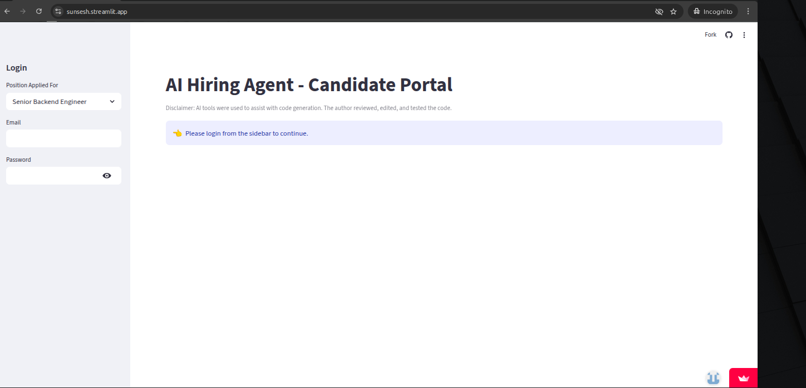
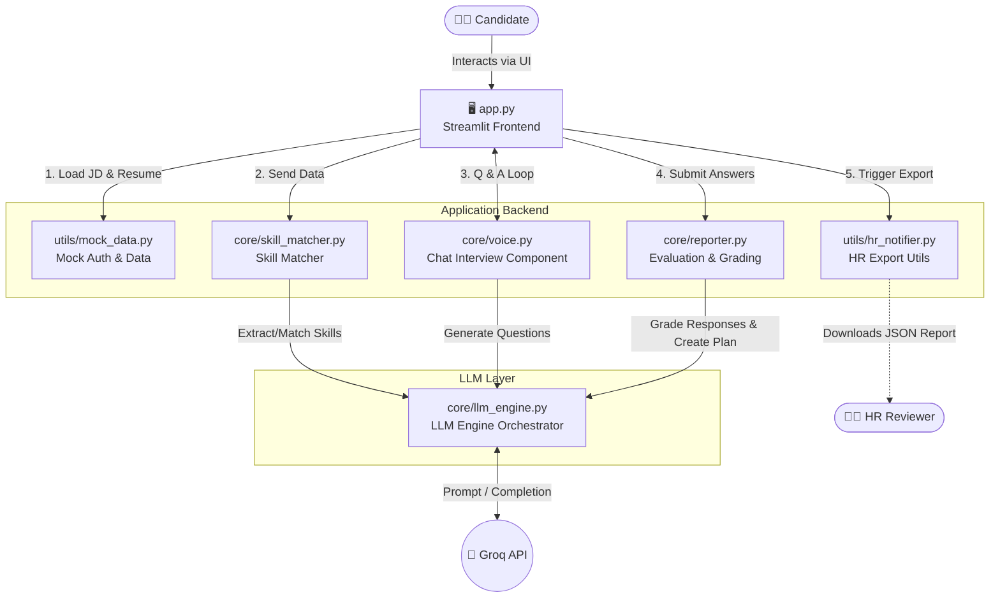

# 🤖 AI Hiring Agent - Candidate Screening Portal

Disclaimer: AI tools were used to assist with code generation. The author reviewed, edited, and tested the code. It was a hand-holding collaboration between the author and the AI. The author held the AI’s hand—though it might have been the other way around.

An intelligent AI hiring assistant built for efficient technical screening. Powered by **Groq** and **Streamlit**, this application extracts skills from a candidate's resume, matches them against a target job description, conducts an interactive AI interview, and generates structured evaluation reports for HR.

For the current hackathon release, the interview experience is implemented as a **chat-based flow** to ensure reliable performance across local and Streamlit Cloud deployments.

---

## 📌 Overview

This project demonstrates an end-to-end AI-assisted candidate screening workflow:

- parse a job description
- analyze a candidate resume
- identify matched and missing skills
- conduct an interactive AI-led interview
- evaluate responses
- generate HR-ready reports and training recommendations

---

## ✨ Features

- **Automated Skill Matching**
  Parses the candidate resume and job description to calculate a weighted fit score.

- **Interactive AI Interview**
  Dynamically generates interview questions based on the top skills required for the role and captures candidate responses through a guided chat interface.

- **AI-Based Interview Grading**
  Uses the LLM to evaluate interview responses and help identify potential gaps between claimed and demonstrated expertise.

- **Custom Training Plans**
  Automatically generates a structured training plan for skills the candidate is missing.

- **HR Reporting**
  Compiles and exports a comprehensive JSON evaluation report for downstream HR review.

---

## 🚀 Hackathon Version Note

The original prototype included a voice-based interview workflow using text-to-speech and speech-to-text. During testing across local and Streamlit Cloud environments, that approach introduced practical deployment issues, including:

- overlapping audio playback in cloud mode
- inconsistent text-to-speech responsiveness in local runs
- browser and environment-specific microphone limitations

To ensure a smooth, stable, and judge-friendly demo experience, the interview module has been temporarily adapted to a **chat-based interaction model**.

The core hiring workflow remains the same:

- job description analysis
- resume-to-skill matching
- AI-generated interview questions
- candidate response evaluation
- final reporting and training recommendations

For compatibility with the existing codebase, the module is still named `core/voice.py`. In the current hackathon version, however, it functions as a **chat interview component** rather than a live voice interface.

---

## 🖼️ Demo Screenshot

---

## 🛠️ Tech Stack

- **Frontend:** Streamlit
- **LLM Engine:** Groq API
- **Data Handling:** Python, JSON, Pandas
- **Interview Mode (Current):** Streamlit chat/text inputs
- **Original Voice Prototype:** `SpeechRecognition`, `gTTS`, `mpg123`

---

## 🏛️ System Architecture

### 🏗️ How this Architecture works (The Flow)

1. **Frontend / Entry:** The `Candidate` interacts with `app.py` (Streamlit).
2. **Data Mocking:** The app uses `utils/mock_data.py` to handle the hackathon constraints (mock logins, preloaded JDs, and baseline resumes).
3. **Skill Matching:** `core/skill_matcher.py` compares the candidate's resume against the chosen Job Description to generate a fit score.
4. **The Interview Loop:** The application calls `core/voice.py`. Even though it's named "voice" (for legacy reasons), it acts as a **Chat Interface**, looping questions and capturing candidate answers.
5. **Grading & Reporting:** The answers are passed to `core/reporter.py`, which evaluates the candidate, identifies gaps, and creates a custom training plan.
6. **LLM Abstraction:** `llm_engine.py` sits as a middle-layer. The Matcher, Interview, and Reporter modules *do not* talk to Groq directly. They all route through `llm_engine.py`, keeping your API calls clean and centralized.
7. **Final Output:** Finally, `utils/hr_notifier.py` packages the outputs into a JSON file, simulating the hand-off to the `HR Reviewer`.

## 📋 Candidate Flow

- Candidate logs in through the sidebar
- Candidate selects the **Position Applied For**
- Candidate reviews or edits:
  - job description
  - resume text
- System analyzes resume fit against the target role
- AI generates targeted interview questions
- Candidate answers interview questions in chat form
- System grades responses and generates:
  - skill match report
  - summary evaluation
  - training recommendations
- HR report can be downloaded as JSON

---

## ⚙️ Setup & Installation (Local Development)

Clone the repository:

    git clone https://github.com/sunsesh/ai_hiring_agent.git
    cd ai_hiring_agent

Create and activate a virtual environment:

    python3 -m venv venv
    source venv/bin/activate

On Windows:

    venv\Scripts\activate

Install Python dependencies:

    pip install -r requirements.txt

Configure Streamlit secrets by creating this file:

    .streamlit/secrets.toml

Add the following values:

    GROQ_API_KEY = "gsk_your_api_key_here"
    DEPLOYED_ON_CLOUD = false

> Do not commit secrets to GitHub.

---

## 💻 Running the App Locally

Start the Streamlit app with:

    streamlit run app.py

Streamlit will typically open the app in your browser at:

    http://localhost:8501

Default test credentials:

- **Email:** `candidate@email.com`
- **Password:** `password123`

---

## ☁️ Cloud Deployment (Streamlit Community Cloud)

This app is designed to run cleanly on Streamlit Community Cloud.

Deployment steps:

- Push your repository to GitHub
- Create a new app in Streamlit Community Cloud
- Select:
  - repository: `sunsesh/ai_hiring_agent`
  - branch: typically `main`
  - main file path: `app.py`

In **App Settings > Secrets**, add:

    GROQ_API_KEY = "gsk_your_api_key_here"
    DEPLOYED_ON_CLOUD = true

In the current hackathon version, the interview is chat-based, so browser microphone and speaker dependencies are not required for the core demo flow.

---

## 🧱 Project Structure

    ai_hiring_agent/
    │
    ├── README.md                  # Project documentation
    ├── .gitignore                 # Ignored files
    ├── requirements.txt           # Python dependencies
    ├── packages.txt               # Optional system dependencies for deployment
    ├── app.py                     # Main Streamlit application
    │
    ├── core/                      # Core business logic
    │   ├── __init__.py
    │   ├── llm_engine.py          # Groq API integration and LLM response handling
    │   ├── skill_matcher.py       # JD vs Resume scoring and skill extraction
    │   ├── voice.py               # Current chat-based interview module
    │   └── reporter.py            # Interview grading and report generation
    │
    └── utils/                     # Supporting utilities
        ├── __init__.py
        ├── mock_data.py           # Mock auth, job descriptions, and resume data
        └── hr_notifier.py         # HR report sharing / simulation utilities

---

## 🧪 Current Hackathon Scope

This project was built as a rapid prototype for a hackathon setting.

Current assumptions:

- authentication is mock-based
- job descriptions are selected from predefined options
- resume text is preloaded but can be overridden by pasted input
- interview interaction is chat-based for stability

Potential production-grade enhancements for future versions:

- database-backed candidate and recruiter workflows
- multi-role HR dashboard
- resume upload and PDF parsing
- browser-native voice capture
- persistent candidate session management
- secure report storage and notifications

---

## 🏁 Demo-Friendly Summary

This hackathon version prioritizes:

- stable cloud deployment
- clean live demonstration behavior
- explainable AI evaluation flow
- minimal setup friction for judges and reviewers

The result is a practical end-to-end hiring workflow that demonstrates how LLMs can support candidate screening, interview evaluation, and training recommendations in a compact, deployable application.

---

## 📌 Notes

- The current `core/voice.py` file is intentionally retained under its original name for compatibility, even though it now powers a chat-based interview flow.
- Secrets such as API keys should be stored in Streamlit secrets and never committed to the repository.
- If audio or voice support is reintroduced later, the app architecture can be extended without changing the overall screening pipeline.

---

## 📄 License

This tool is open to all users; simply input your Groq API key as an environment variable (or a secret in streamlit site) to get started.
